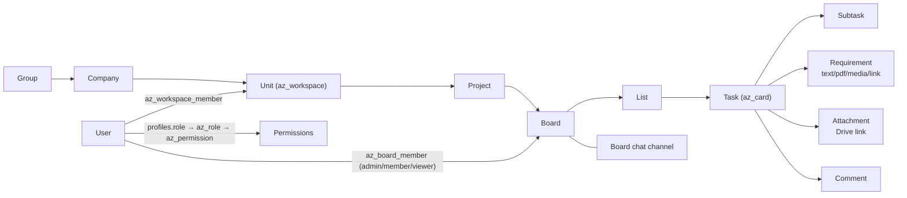
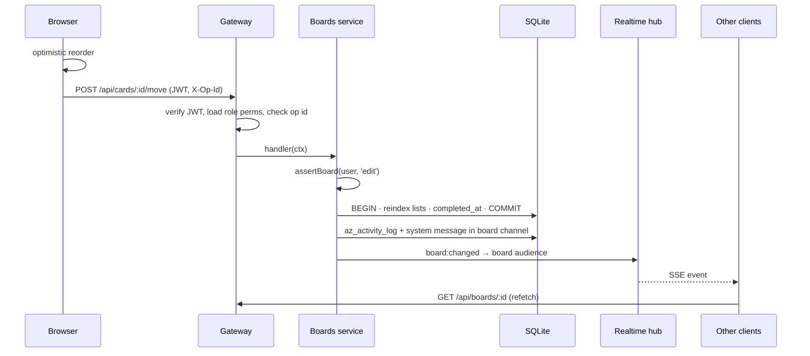
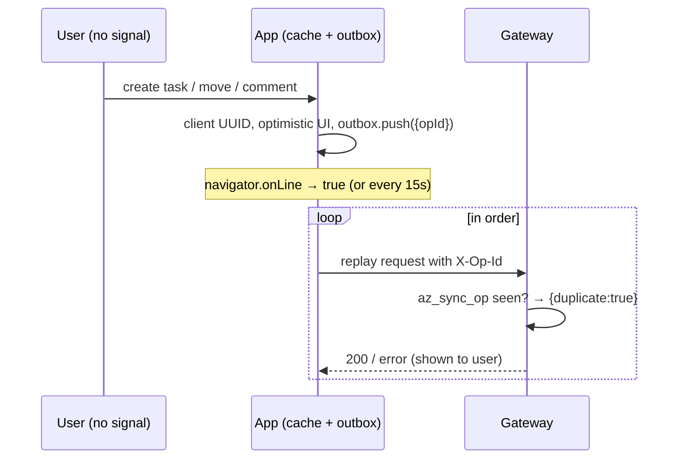
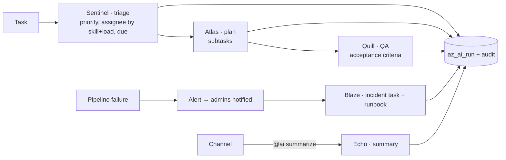
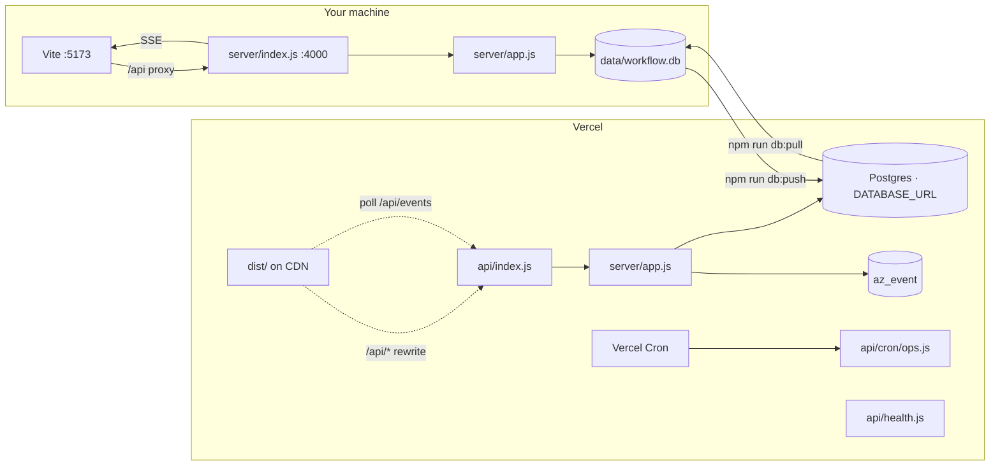
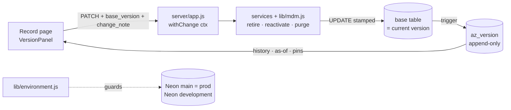

# Workflow Hub — architecture & flows

## Service communication
```mermaid
flowchart TB
  subgraph Clients
    W[React + Vite PWA<br/>desktop & mobile]:::c
    F[Field teams<br/>offline outbox]:::c
    A[Admins]:::c
  end
  W -- REST /api + JWT --> G
  F -- replay with X-Op-Id --> G
  A -- SSE locally / poll /api/events on Vercel --> G
  G[server/app.js<br/>local: server/index.js · Vercel: api/index.js]:::g
  G --> AU[Auth] & OR[Org] & BO[Boards] & TA[Tasks] & CH[Chat] & SE[Search] & RE[Reports] & AI[AI crew] & OP[Ops] & AD[Admin]
  AU & OR & BO & TA & CH & SE & RE & AI & OP & AD --> DB[(SQLite locally<br/>PostgreSQL on Vercel)]:::d
  BO & TA & CH & OP & AI --> RT[Real-time hub<br/>SSE fan-out]
  RT -. events .-> W
  OP --> SCH[Scheduler<br/>30s timer locally · Vercel Cron]
  AI -. optional .-> CL[Claude API]
  TA -. links only .-> GD[Google Drive]
  classDef c fill:#1e3a8a,color:#fff; classDef g fill:#4c1d95,color:#fff; classDef d fill:#065f46,color:#fff;
```

## Organisation hierarchy


## Moving a task (request + real-time)


## Offline sync


## AI crew


## Local vs Vercel


## Enterprise data model: versioning, no-delete, MDM

Every business table is registered in `server/db/versioning.js`. Triggers generated from that registry, on PostgreSQL and SQLite, enforce these rules:

- Every insert or business change appends a version to `az_version`, recording the snapshot, the changed fields, who made the change, why, and the pinned versions of any referenced master data.
- `DELETE` is refused. Records are retired instead (`is_active = 0`).
- Business keys and document numbers are immutable.
- New references to retired data are refused.
- `az_version` and `az_activity_log` are append-only.



See [MDM_VERSIONING.md](MDM_VERSIONING.md) for the full design: all 14 points, including Neon branches and the table of every replaced UPDATE/DELETE.
